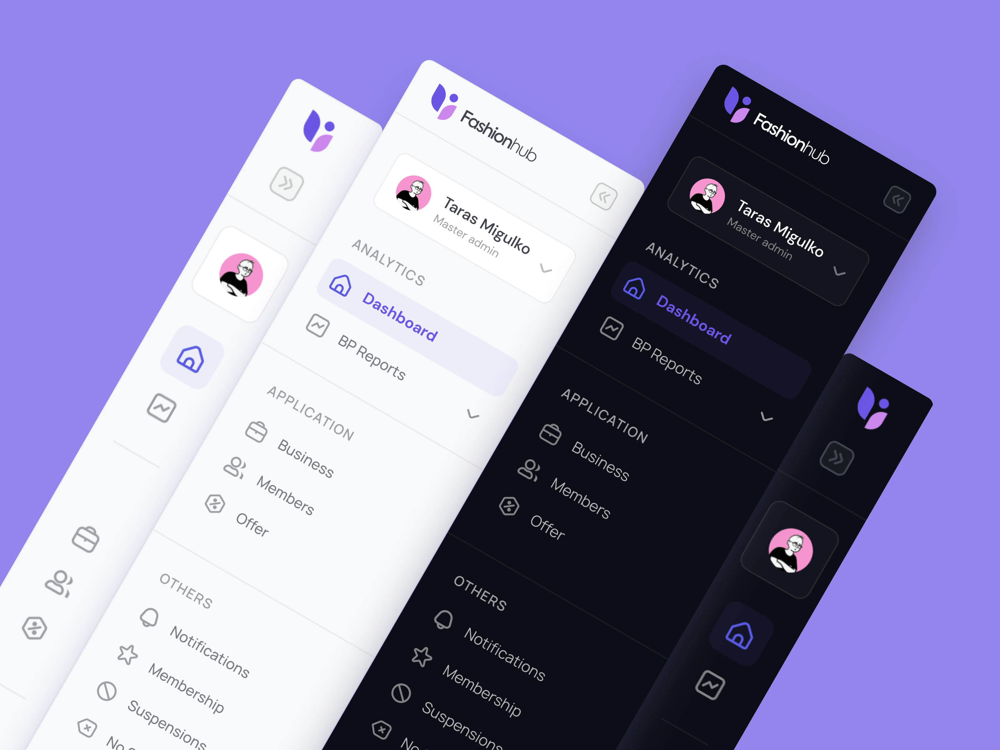

# Fashionhub Sidebar Navigation

This project is inspired by [Dashboard Sidebar Navigation + Tooltip (Dark/Light)](https://dribbble.com/shots/17122423-Dashboard-Sidebar-Navigation-Tooltip-Dark-Light).

Design credits to [@uxhooks](https://dribbble.com/uxhooks) in Dribbble.

  

## Technologies

- **[ReactJs](https://reactjs.org/)** A JavaScript library for building UI.
- **[Vite](https://vitejs.dev/)** Next Generation Frontend Tooling.
- **[Tailwind CSS](https://tailwindcss.com/)** A utility-first CSS framework packed with classes (basic configuration).

_Note: Descriptions taken from website._

## Disclaimer

Project built out in order to put into practice skills as a Frontend developer, taking interfaces created by talented designers as a source of inspiration.

## Contributing

If you're interested in contributing to this project, please feel free to send your [Pull Request](https://github.com/ui-inspirations/fashionhub-sidebar-navigation/pulls).
